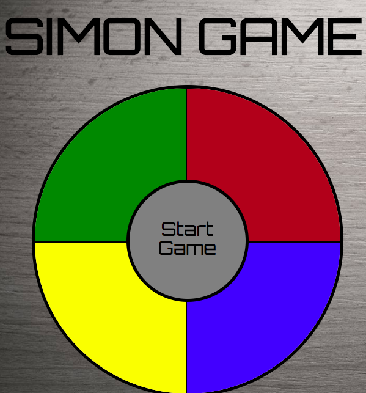

# **SIMON GAME**

## **Description:**

This is a simon game that creates a random series of lights and wait for the player to repeat that sequence.

## **DEMO:**
https://nouraalhadlaq.github.io/simon/

## **Used Technologies:**

- HTML5
- CSS
- javascript
- JQuery

## **Credits:**

- animate.css
- Sweatalert
- Google Fonts
- [stackoverflow](https://stackoverflow.com/questions/43720936/how-to-create-blinking-text-with-css-only)

## **Features:**

- display a sequence of colors lights-up.
- get player clicks and check if matches the sequence.

## **Future Ideas:**

- Audio for each color.
- add score counter.

## **Screen Shot:**

